

LAPORAN RESMI  
WORKSHOP ADMINISTRASI JARINGAN  
PRAKTIKUM 3 - Winbox & NTP  

Dosen Pengampu: 
Dr. Ferry Astika Saputra ST, M.Sc  

Disusun Oleh: 
Hanif Nabila [ 3121600046 ] 
Maritza Retno Dwianti [ 3121600054 ] 
Muhammad Hafid Azis [ 3121600055 ] 
2 D4 IT B  

PROGRAM STUDI TEKNIK INFORMATIKA 
POLITEKNIK ELEKTRONIKA NEGERI SURABAYA 
TAHUN 2023

   

### 1. Setting IP dan Interface
Untuk setting IP dan interface menggunakan winbox. Winbox sendiri merupakan sebuah aplikasi yang digunakan untuk konfigurasi Mikrotik RouterOS menggunakan GUI. langkah pertama yang dilakukan menjalankan winbox melalui terminal menggunakan perintah <b>wine winbox64.exe</b> 

 Setelah menjalankan perintah diatas maka akan muncul tampilan seperti gambar dibawah 
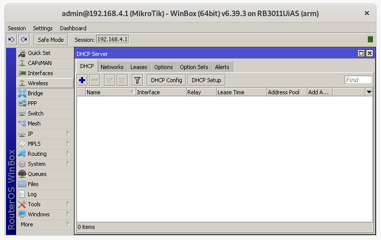
 Untuk mengatur IP Address, pada bagian menu samping pada winbox click IP lalu addresses 
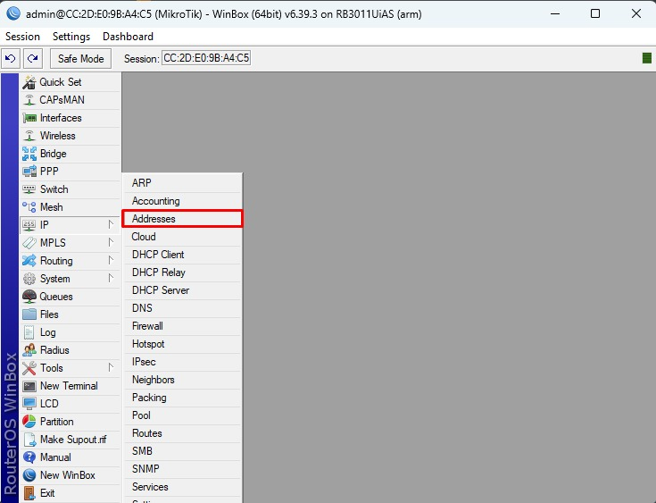
 Kemudian akan muncul tampilan seperti gambar dibawah, Selanjutnya tambahkan ip address pada tanda plus yang diberi panah 
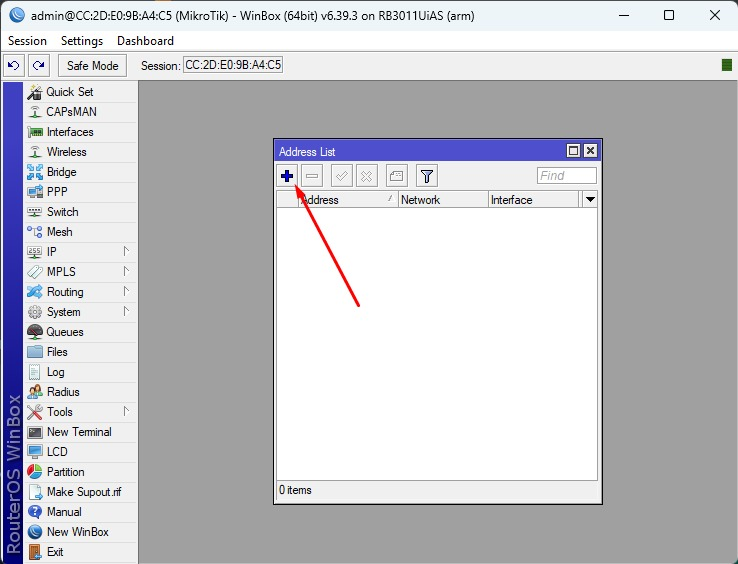
 Masukkan address <b> 192.168.4.1</b> dengan Network <b>192.168.4.0</b> dan pilih inteface <b>ethernet 2</b> selanjutnya click <b>Apply</b>, maka IP yang telah dimasukkan akan tampil pada address list

### 2. Seting Default Gateway 0.0.0.0/0 IP Route Gateway 10.252.108.212
 Untuk setting IP Routes dan Default Gateway click IP kemudian Routes 

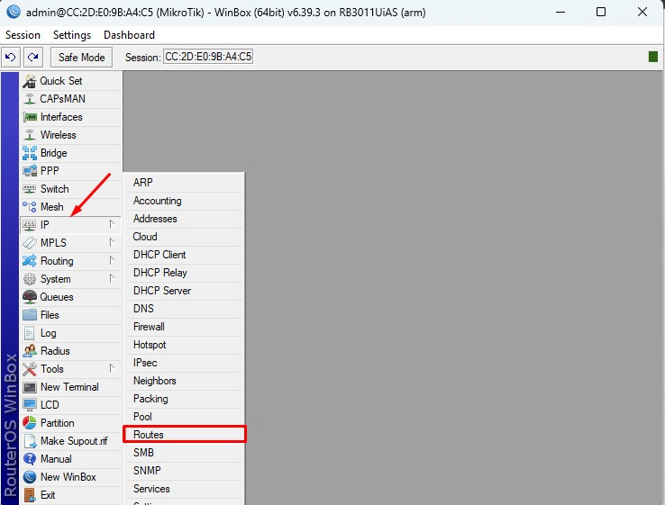
 kemudian pada tab routes tambahkan menggunakan icon yang diberi tanda panah lalu click 

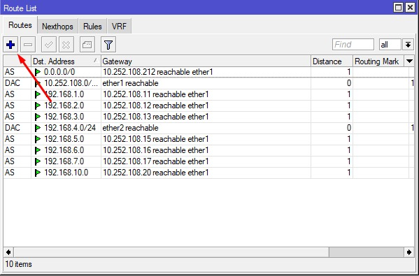
  Masukkan IP  
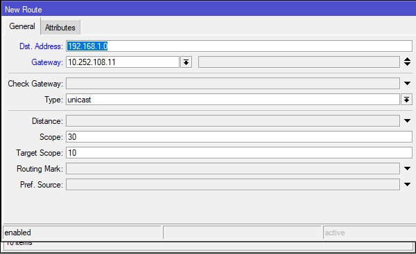
 Masukkan Default gateway 
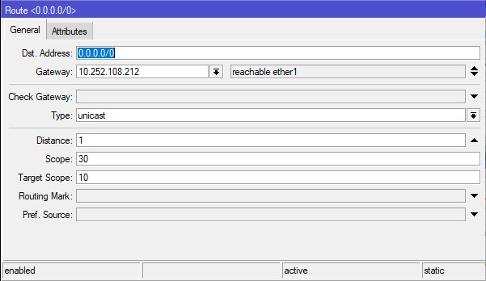
 
List IP Address yang di inputkan 
<b>Kelompok 1: </b> 
Gateway : 10.252.108.20 
Network Address : 192.168.10.1  
<b>Kelompok 2: </b> 
Gateway : 10.252.108.12 
Neywork Address : 192.168.2.1  
<b>Kelompok 3: </b> 
Gateway: 10.252.108.13 
Network Address : 192.168.3.1  
<b>Kelompok 4: </b> 
Gateway : 10.252.108.14 
Network Address : 192.168.4.1  
<b>Kelompok 5: </b> 
Gateway : 10.252.108.15 
Network Address : 192.168.5.1  
<b>Kelompok 6: </b> 
Gateway : 10.252.108.16 
Network Address : 192.168.6.1  
<b>Kelompok 7: </b> 
Gateway : 10.252.108.17 
Network Address : 192.168.7.1  
<b>Kelompok 8: </b> 
Gateway : 10.252.108.18 
Network Address : 192.168.8.1  
<b>Kelompok 9: </b> 
Gateway : 10.252.108.19 
Network Address : 192.168.9.1  

### 3. Setting DHCP Server via DHCP setup [192.168.X.100 - 254]
Pada menu pilih <b>IP</b> kemudian akan muncul opsi pilih <b>DHCP Server</b> 

 Selanjutnya pada bagian DHCP pilih <b>DHCP Setup</b> seperti pada gambar yang diberi tanda panah, kemudian pilih <b>ethernet2</b> pada interface, Masukkan Address, dan Gateway serta masukkan range yakni <b>192.168.4.100 - 192.168.4.254</b> 

Pilih Interface eth2 
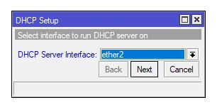

 Masukkan Address dan gateway 

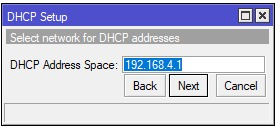
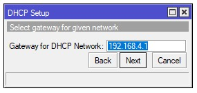 
  Masukkan Range yakni 192.168.4.100 - 192.168.4.254 

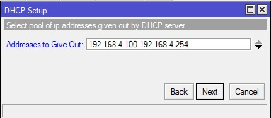
  Masukkan DNS Server 

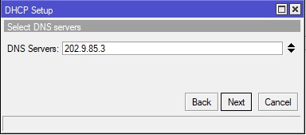

### 4. Sambungkan PC/Laptop ke jaringan, Check IP Address Pastikan IP Address dari PC mendapatkan IP Address dan DHCP server
Untuk menyambungkan laptop/PC ke jaringan buka Control Panel, Network and Internet, Network Connections selanjutnya pilih Ethernet2 
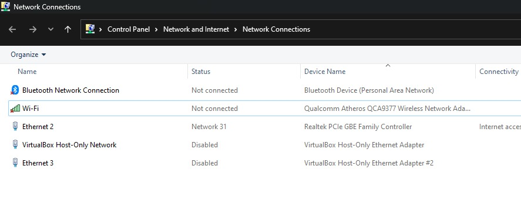
 Selanjutnya click properties

  Selanjutnya pilih IPv4  

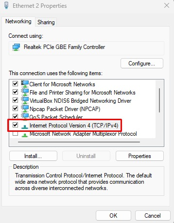
  Pada general pilih Obtain an IP address automatically dan Obtain DNS Server address automatically, dimana kita akan mendapatkan ip secara otomatis  

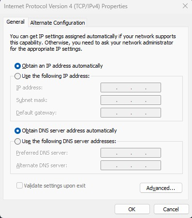

  Kemudian cek pada Network Connection Details pada IPv4 Address, Default gateway dan DHCP server masing masing telah mendapatkan 

### 5. Power up, Nyalakan PC VM anda pastikan konfigurasi BRIDGE, Pastikan mendapatkan IP Adddress dari DHCP Server
Pada VM Pergi ke settings kemudian pada network pastikan attached to Bridged adapter 
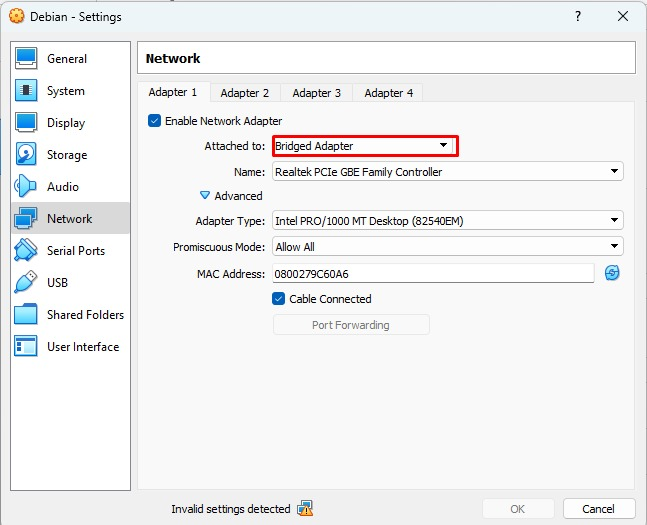

### 6. Konfigurasi IP VM menjadi static, IP: 192.168.X.10
Untuk mengkonfigurasikan IP VM kita konfigurasikan melalui terminal, dengan menjalankan perintah sudo nano /etc/network/interfaces kemudian enter 

  Pada sudo nano tambahkan enp0s3, iface enp0s3 inet static, masukkan address 192.168.4.10 serta netmask dan gateway selanjtnya simpan lalu ctrl exit. 

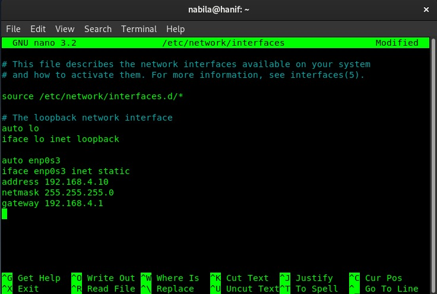
  Lakukan reastart 

### 7. Konfigurasi NTP ke 0.id.pool.ntp.org, 1.id.pool.ntp.org

Merubah pengaturan sistem waktu, Set sistem timezone menggunakan command dibawah 

  Aktifkan klien NTP untuk sinkronisasi waktu. Edit timesyncd.conf untuk menentukan server NTP yang Anda gunakan 

 Jika jaringan ditutup, tentukan server NTP lokal seperti gambar dibawah, masukkan NTP=0.id.pool.ntp.org kemudian simpan 

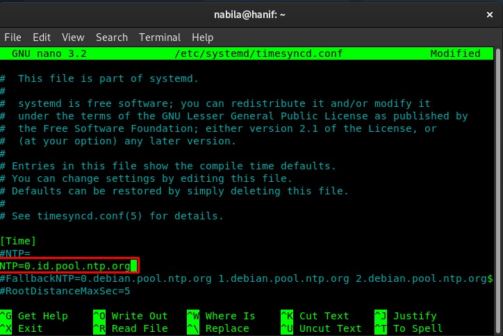
 Restart layanan sinkronisasi waktu. kemudian konfirmasikan layanan sinkronisasi waktu aktif. Selanjutnya Periksa pengaturan waktu dan tanggal. 

### 9. Ganti Hostname VM [/etc/hostname server10.kelompokX.takehome.com]
 Untuk mengganti Hostname pada VM, buka terminal pada VM selanjutnya jalankan perintah <b>sudo nano /etc/hostname<b>

 setelah itu masukkan <b> server10.kelompok4.takehome.com<b>

